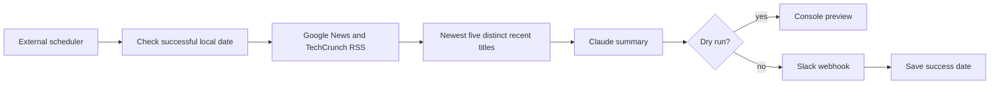

# Daily AI Slack Digest

A recovered personal worker that collects recent AI headlines, requests plain-English explanations from Claude, and can deliver a five-story briefing to Slack.

**Recovered work:** feed collection, title deduplication, recency selection, summarization, webhook delivery, retry loop and local successful-date tracking. **New portfolio work (2026-09-25):** offline fixture demo, tests, dry-run output, isolated configuration, future-date rejection, request timeouts and import-safe entry point. See [PROVENANCE.md](PROVENANCE.md).

## Credential-free demo

Requires Node.js 22. From this directory:

```sh
npm ci
npm run demo
npm test
```

The demo passes six fictional feed items, including a duplicate, through the real selection function and displays five results. It does not call Claude or Slack. These are synthetic headlines, not current news.

## Configure the real worker

Copy `.env.example` to `.env`. Supply `ANTHROPIC_API_KEY`, an `ANTHROPIC_MODEL` available to your account, and `SLACK_WEBHOOK_URL`. The model default is inherited from the recovered worker and was not live-validated in this reconstruction. Optional `DIGEST_TIMEZONE` defaults to `America/New_York`.

`npm run dry-run` fetches real feeds and makes a paid model call, prints the generated briefing, and does not post or mark a delivery successful. `npm run digest` sends to the configured Slack webhook. These live actions were not run while preparing the portfolio.

## Architecture



Selection is based on recency and normalized headline uniqueness. It does not implement a learned importance score, fact verification, semantic deduplication or source-quality ranking. The model receives feed summaries, not full articles.

## Scheduling and reliability

Configure an external scheduler to run `node src/daily-ai-picks.js` from this repository. The original workflow used Windows Task Scheduler with primary and backup runs; its history is in [docs/PROJECT_LOG.md](docs/PROJECT_LOG.md). No scheduler was installed or changed in this reconstruction. The supplied `run-digest.cmd` is portable within this repository.

Successful-date tracking suppresses sequential same-day runs. It does **not** guarantee exactly-once delivery: concurrent runs, or a crash after Slack accepts a message but before the state is saved, can duplicate posts. Configure the scheduler to disallow overlap. Retries of ambiguous delivery failures can also duplicate messages. Feed or model failures can still prevent delivery. See [docs/ARCHITECTURE.md](docs/ARCHITECTURE.md).

## Demonstrate the project

See [docs/DEMO.md](docs/DEMO.md). No measured readership, time-saved or delivery-rate claims are included. Keep `.env`, runtime logs and state outside version control.
